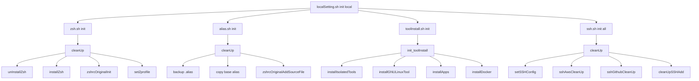

# 関数相関図

---

## 全体アーキテクチャ

```
┌─────────────────────────────────────────────────────────────────────────────┐
│                           localSetting.sh (エントリポイント)                    │
├─────────────────────────────────────────────────────────────────────────────┤
│  initLocal() ─────────────────────────────────────────────────────────────► │
│  initModules()    updateModules()    deleteModules()                        │
│       │                │                   │                                │
│       ▼                ▼                   ▼                                │
│  ┌─────────────────────────────────────────────────────────────────────┐   │
│  │                    src/app/commands/                                 │   │
│  │  zsh.sh  alias.sh  ssh.sh  toolInstall.sh  docker.sh  upgrade.sh   │   │
│  └─────────────────────────────────────────────────────────────────────┘   │
│                                    │                                        │
│                                    ▼                                        │
│  ┌─────────────────────────────────────────────────────────────────────┐   │
│  │                    src/app/helpers/                                  │   │
│  │  zsh.sh  ssh/  tool/  docker.sh  dockerProject.sh  config.sh  ...  │   │
│  └─────────────────────────────────────────────────────────────────────┘   │
│                                    │                                        │
│                                    ▼                                        │
│  ┌─────────────────────────────────────────────────────────────────────┐   │
│  │                    src/app/lib/                                      │   │
│  │  oo-bootstrap.sh (OOPフレームワーク)                                  │   │
│  │  util/  util_ext/  Array/  String/  UI/  TypePrimitives/           │   │
│  └─────────────────────────────────────────────────────────────────────┘   │
└─────────────────────────────────────────────────────────────────────────────┘
```

---

## メインスクリプト (localSetting.sh)

```
localSetting.sh
│
├── shellReLogin()          # zshへ再ログイン
├── outputLog()             # ログ出力（共通）
├── outputStartLog()        # 開始ログ
├── outputSuccessLog()      # 成功ログ
├── outputErrorLog()        # エラーログ
├── outputResultLog()       # 結果ログ
│
├── initLocal()             # 段階的初期化
│   ├── → zsh.sh init
│   ├── → alias.sh init
│   ├── → toolInstall.sh init
│   ├── → zsh.sh update original
│   └── → ssh.sh init all
│
├── initModules()           # モジュール初期化
│   └── → modules/<module>.sh init
│
├── updateModules()         # モジュール更新
│   └── → modules/<module>.sh update
│
└── deleteModules()         # モジュール削除
    └── → modules/<module>.sh delete
```

---

## コマンドスクリプト間の関係

### init コマンドフロー



---

## zsh.sh 関数相関図

```
zsh.sh
│
├── cleanUp()                    # 初期化（メイン）
│   ├── → unInstallZsh          (alias → ZshCommon::UnInstall)
│   ├── → installZsh            (alias → ZshCommon::Install)
│   ├── → zshrcOriginalInit     (lib/util_ext/zsh.sh)
│   └── → setZprofile           (alias → ZshCommon::SetZprofile)
│
├── remove()                     # アンインストール
│   └── → unInstallZsh
│
├── updatePassPhrase()           # パスフレーズ更新
│   ├── → zshrcOriginalReplaceWordOfRegExp
│   └── → setPassPhrase         (alias → ZshCommon::SetPassPhrase)
│
├── updateGithubToken()          # GitHubトークン更新
│   ├── → zshrcOriginalReplaceWordOfRegExp
│   └── → setGithubToken        (alias → ZshCommon::SetGithubToken)
│
├── updateLdapPass()             # LDAPパスワード更新
│   ├── → zshrcOriginalReplaceWordOfRegExp
│   └── → setLdapPass           (alias → ZshCommon::SetLdapPass)
│
└── updateLdapUser()             # LDAPユーザー更新
    ├── → zshrcOriginalReplaceWordOfRegExp
    └── → setLdapUser           (alias → ZshCommon::SetLdapUser)
```

### helpers/zsh.sh (ZshCommon クラス)

```
ZshCommon (helpers/zsh.sh)
│
├── SetZprofile()               # .zprofile設定
├── Install()                   # zshインストール
│   ├── → InstallOhMyZsh()
│   └── → InitZshrcOriginal()
│       ├── → SetPassPhrase()
│       ├── → SetGithubToken()
│       ├── → SetLdapUser()
│       └── → SetLdapPass()
├── InstallByBrew()             # Homebrew経由インストール
├── InstallOhMyZsh()            # oh-my-zshインストール
├── UnInstall()                 # アンインストール
│   └── → UnInstallOhMyZsh()
├── UnInstallByBrew()           # Homebrew経由アンインストール
├── UnInstallOhMyZsh()          # oh-my-zshアンインストール
├── SetPassPhrase()             # パスフレーズ設定
├── SetGithubToken()            # GitHubトークン設定
├── SetLdapUser()               # LDAPユーザー設定
├── SetLdapPass()               # LDAPパスワード設定
└── outputSetting()             # 設定表示
```

---

## ssh.sh 関数相関図

```
ssh.sh
│
├── cleanUp()                    # SSH初期化
│   ├── → setSSHConfig          (alias → SSHCommon::SetConfig)
│   ├── → sshAwsCleanUp         (helpers/ssh/aws.sh)
│   ├── → sshGithubCleanUp      (helpers/ssh/github.sh)
│   ├── → cleanUpSSHAdd()
│   └── → outPutSuccess()
│
├── cleanUpSSHAdd()              # SSH鍵再登録
│   ├── → cleanSSHChmod         (alias → SSHCommon::CleanSSHChmod)
│   └── → exSSHAdd              (lib/util_ext/ssh.sh)
│
├── update()                     # 全SSH設定更新
│   └── → updateModules()
│
├── initModules()                # モジュール初期化
│   └── → ssh{Module}CleanUp    (動的alias呼び出し)
│
├── updateModules()              # モジュール更新
│   └── → ssh{Module}Update     (動的alias呼び出し)
│
└── remove()                     # SSH設定削除
    └── → removeAllConfig       (alias → SSHCommon::ReMoveAllConfig)
```

### helpers/ssh/common.sh (SSHCommon クラス)

```
SSHCommon (helpers/ssh/common.sh)
│
├── CleanSSHChmod()             # 権限設定
│   ├── → dirAllOwnerOfUser()
│   ├── → secretDir()
│   ├── → secretDirALL()
│   └── → publicFilesOfName()
│
├── SetConfig()                 # SSH設定セットアップ
│   ├── → createSecretDir()
│   ├── → copyOfSecretFile()
│   ├── → patchExecute()
│   └── → UpdateConfig()
│
├── UpdateConfig()              # 設定追加
│   └── → gsAddUniqueRow()
│
├── ReMoveAllConfig()           # 設定削除
├── UpdateSetting()             # 設定更新
│   ├── → copyOfSecretFile()
│   ├── → patchExecute()
│   └── → copyOfSecretDir()
│
└── CreateKey()                 # SSH鍵作成
    └── → sshCreateKey()
```

---

## toolInstall.sh 関数相関図

```
toolInstall.sh
│
├── init_toolInstall()           # 初期化（メイン）
│   ├── → installIsolatedTools()
│   ├── → installGNULinuxTool()
│   ├── → installApps()
│   └── → installDocker()
│
├── installIsolatedTools()       # CLIツールインストール
│   ├── → toolInstall("brew", "tig", ...)
│   ├── → toolInstall("brew", "lolcat", ...)
│   ├── → toolInstall("brew", "jq", ...)
│   ├── → toolInstall("brew", "yq", ...)
│   ├── → toolInstall("brew", "expect", ...)
│   ├── → toolInstall("brew", "awscli", ...)
│   ├── → toolInstall("brew", "session-manager-plugin", ...)
│   ├── → toolInstall("brew", "anyenv", ...)
│   └── → zshrcAddWord()
│
├── installGNULinuxTool()        # GNU/Linuxツール
│   ├── → toolInstall("brew", "coreutils", ...)
│   ├── → toolInstall("brew", "gzip", ...)
│   ├── → toolInstall("brew", "findutils", ...)
│   └── → zshrcAddWord()
│
├── installApps()                # GUIアプリ
│   └── → toolInstall("app", "Sequel Ace", ...)
│
├── installDocker()              # Docker関連
│   ├── → toolInstall("brew", "composer", ...)
│   ├── → toolInstall("brew", "docker", ...)
│   └── → toolReLink()
│
└── updateModules()              # モジュール更新
    └── → tool{Module}Install   (動的alias呼び出し)
```

### helpers/tool/common.sh (Tool クラス)

```
Tool (helpers/tool/common.sh)
│
├── Install()                   # インストール
│   ├── → IsExist()
│   └── → CheckInstallSuccess()
│
├── UnInstall()                 # アンインストール
│   ├── → IsExist()
│   └── → CheckUnInstallSuccess()
│
├── IsExist()                   # 存在確認
│   ├── type判定
│   ├── which判定
│   ├── app判定 → IsExistFile()
│   ├── brew判定
│   ├── anyenv判定
│   └── version判定
│
├── ReLink()                    # リンク再作成
├── DeleteSetting()             # 設定削除
└── PHPENV()                    # PHPバージョン切替
```

---

## docker.sh 関数相関図

```
docker.sh
│
├── (初期化処理)
│   ├── Config docker_config    # Docker設定読込
│   ├── Config database_config  # DB設定読込
│   └── Config git_config       # Git設定読込
│
├── executeTask()               # artisanタスク実行
│   └── → dockerApp()          (lib/util_ext/docker.sh)
│
├── cacheClear()                # キャッシュクリア
│   └── → dockerApp()
│
├── containerRemove()           # コンテナ削除
│   └── → dockerDestroy()      (lib/util_ext/docker.sh)
│
└── dockerDatabaseLogin()       # DBログイン
    └── → dockerDB()           (lib/util_ext/docker.sh)
```

---

## DockerProject クラス相関図

```
DockerProject (helpers/dockerProject.sh)
│
├── __constructor__()
│   ├── → GitHubCommon.__constructor__()
│   └── → DockerCommon.__constructor__()
│
├── DeleteProject()             # プロジェクト削除
│   ├── → dockerDestroy()
│   ├── → aliasDeleteWord()
│   └── → dockerBuildCacheRemove()
│
├── GitClone()                  # Git clone
│   └── → github_common.Clone()
│
├── Latest()                    # 最新取得
│   └── → github_common.Latest()
│
├── GitSkip/NoSkip()            # skip-worktree制御
│   └── → github_common.Skip/NoSkip()
│
├── GitLocalRepositoryHooks()   # Gitフック設定
│   └── → github_common.LocalRepositoryHooks()
│
├── Archive()                   # アーカイブ
│   └── → docker_common.ProjectArchive()
│
├── EnvSetting()                # 環境設定
│   ├── → env_common.SettingDefault()
│   └── → env_common.SettingTesting()
│
├── ContainerBuild()            # コンテナビルド
│   ├── → docker_common.EnvSetting()
│   ├── → docker_common.PlatformSetting()
│   └── → docker_common.ProjectBuild()
│
├── ContainerInitialize()       # 初期化
│   ├── → ImportDataBase()
│   ├── → ContainerAPPExecInitShell()
│   └── → ContainerAPPExecInitShellEnv()
│
├── ImportDataBase()            # DBインポート
│   ├── → docker_common.DataBaseDump()
│   └── → docker_common.ContainerDBImportDataBase()
│
└── ExecUploadShell()           # シェル実行
    ├── → docker_common.ContainerCopyFile()
    ├── → docker_common.ContainerExecCommand()
    └── → docker_common.ContainerDeleteFile()
```

---

## upgrade.sh 関数相関図

```
upgrade.sh
│
├── shellReLogin()              # シェル再ログイン
│
├── deleteTool()                # 不要ツール削除
│   └── → toolUnInstall()
│
├── upgradeZsh()                # zsh設定更新
│   ├── → gsDeleteLikeWord()
│   ├── → gsAddTargetRowNo()
│   ├── → upgradeTool()
│   └── → zsh.sh update original
│
├── upgradeAlias()              # エイリアス更新
│   ├── → alias.sh init
│   └── → modules/<module>.sh update alias
│
├── upgradeTool()               # ツール更新
│   ├── → deleteTool()
│   ├── → toolInstall.sh init
│   └── → modules/<module>.sh update tool
│
├── upgradeSSH()                # SSH設定更新
│   └── rm ~/.ssh/known_hosts
│
├── upgradeEnv()                # 環境変数更新
│   └── → modules/<module>.sh update env
│
├── upgradeGitHooks()           # Gitフック更新
│   └── → modules/<module>.sh update hooks
│
└── upgradeTestSetting()        # テスト設定リセット
    └── → toolUnInstall("anyenv")
```

---

## ライブラリ (lib/util_ext) 依存関係

```
util_ext/
│
├── log.sh                      # ログ出力
│   ├── outputInfoLog()
│   ├── outputStartLog()
│   ├── outputResultLog()
│   ├── outputErrorLog()
│   └── inputMsg()
│
├── zsh.sh                      # zsh操作
│   ├── zshrcAddWord()
│   ├── zshrcDeleteWord()
│   ├── zshrcAddSourceFile()
│   ├── zshrcOriginalInit()
│   ├── zshrcOriginalAddSourceFile()
│   ├── zshrcOriginalReplaceWord()
│   └── zshrcOriginalReplaceWordOfRegExp()
│
├── alias.sh                    # エイリアス操作
│   ├── aliasAddSourceFile()
│   └── aliasDeleteWord()
│
├── gsed.sh                     # GNU sed操作
│   ├── gsAddUniqueRow()
│   ├── gsAddUniqueRowSudo()
│   ├── gsAddTargetRowNo()
│   ├── gsReplaceOFRegExpFirst()
│   ├── gsDeleteLikeWord()
│   └── gsReplaceCamelCase()
│
├── docker.sh                   # Docker操作
│   ├── dockerStart()
│   ├── dockerStop()
│   ├── dockerReStart()
│   ├── dockerDestroy()
│   ├── dockerApp()
│   ├── dockerDB()
│   ├── dockerRedis()
│   ├── dockerLog()
│   └── dockerBuildCacheRemove()
│
├── ssh.sh                      # SSH操作
│   ├── sshCreateKey()
│   └── exSSHAdd()
│
├── chmod.sh                    # 権限操作
│   ├── dirAllOwnerOfUser()
│   ├── secretDir()
│   ├── secretDirALL()
│   ├── publicDirALL()
│   ├── publicFilesOfName()
│   ├── createSecretDir()
│   ├── copyOfSecretFile()
│   └── copyOfSecretDir()
│
├── json.sh                     # JSON操作
│   ├── jsonGetValue()
│   ├── jsonGetKeys()
│   └── jsonGetArrayToString()
│
├── yml.sh                      # YAML操作
│   ├── ymlGetValue()
│   ├── ymlGetKeys()
│   └── ymlGetArrayToString()
│
├── github.sh                   # GitHub操作
│   ├── githubClone()
│   └── githubLatest()
│
├── providers.sh                # パスプロバイダー
│   ├── resourceDir()
│   ├── resourceZsh()
│   ├── resourceSSH()
│   ├── resourceAlias()
│   ├── resourceDocker()
│   ├── resourceModules()
│   └── configDir()
│
└── find.sh                     # ファイル検索
    └── findOfFileCount()
```

---

## クラス継承・依存関係

```
┌─────────────────────────────────────────────────────────────────────┐
│                    OOP Framework (oo-bootstrap.sh)                  │
│  class:  namespace  import  private  string  this  Type::Initialize │
└─────────────────────────────────────────────────────────────────────┘
                                    │
                                    ▼
    ┌───────────────────────────────────────────────────────────┐
    │                       Config クラス                        │
    │  ┌─────────────────────────────────────────────────────┐ │
    │  │ config_path, root_key, extension                    │ │
    │  │ GetKeys(), Get(), GetArrayToString()                │ │
    │  └─────────────────────────────────────────────────────┘ │
    └───────────────────────────────────────────────────────────┘
                                    │
                    ┌───────────────┼───────────────┐
                    ▼               ▼               ▼
    ┌─────────────────────┐ ┌─────────────────┐ ┌─────────────────┐
    │   GitHubCommon      │ │  DockerCommon   │ │    EnvCommon    │
    │ ┌─────────────────┐ │ │ ┌─────────────┐ │ │ ┌─────────────┐ │
    │ │ Clone()         │ │ │ │ Build()     │ │ │ │ Setting()   │ │
    │ │ Latest()        │ │ │ │ Destroy()   │ │ │ │ Update()    │ │
    │ │ Skip()          │ │ │ │ Import()    │ │ │ └─────────────┘ │
    │ └─────────────────┘ │ │ └─────────────┘ │ └─────────────────┘
    └─────────────────────┘ └─────────────────┘
                    │               │               │
                    └───────────────┼───────────────┘
                                    ▼
                    ┌───────────────────────────────┐
                    │       DockerProject クラス     │
                    │ ┌───────────────────────────┐ │
                    │ │ github_common (GitHubCommon)│
                    │ │ docker_common (DockerCommon)│
                    │ │ env_common (EnvCommon)     │ │
                    │ │                           │ │
                    │ │ DeleteProject()           │ │
                    │ │ GitClone() → github_common │
                    │ │ ContainerBuild() → docker  │
                    │ │ EnvSetting() → env_common  │
                    │ └───────────────────────────┘ │
                    └───────────────────────────────┘
```

---

## エイリアス一覧

各ヘルパーで定義されているエイリアス:

| エイリアス | 実体 | 定義ファイル |
|-----------|------|-------------|
| `setZprofile` | ZshCommon::SetZprofile | helpers/zsh.sh |
| `installZsh` | ZshCommon::Install | helpers/zsh.sh |
| `unInstallZsh` | ZshCommon::UnInstall | helpers/zsh.sh |
| `setPassPhrase` | ZshCommon::SetPassPhrase | helpers/zsh.sh |
| `setGithubToken` | ZshCommon::SetGithubToken | helpers/zsh.sh |
| `setLdapUser` | ZshCommon::SetLdapUser | helpers/zsh.sh |
| `setLdapPass` | ZshCommon::SetLdapPass | helpers/zsh.sh |
| `cleanSSHChmod` | SSHCommon::CleanSSHChmod | helpers/ssh/common.sh |
| `setSSHConfig` | SSHCommon::SetConfig | helpers/ssh/common.sh |
| `removeAllConfig` | SSHCommon::ReMoveAllConfig | helpers/ssh/common.sh |
| `updateSetting` | SSHCommon::UpdateSetting | helpers/ssh/common.sh |
| `createKey` | SSHCommon::CreateKey | helpers/ssh/common.sh |
| `toolInstall` | Tool::Install | helpers/tool/common.sh |
| `toolUnInstall` | Tool::UnInstall | helpers/tool/common.sh |
| `toolIsExist` | Tool::IsExist | helpers/tool/common.sh |
| `toolReLink` | Tool::ReLink | helpers/tool/common.sh |
| `toolDeleteSetting` | Tool::DeleteSetting | helpers/tool/common.sh |
| `toolPHPENV` | Tool::PHPENV | helpers/tool/common.sh |

---

## データフロー

```
ユーザー入力
    │
    ▼
localSetting.sh
    │
    ├─[init]──────► commands/*.sh ──► helpers/*.sh ──► lib/util_ext/*.sh
    │                    │                  │                  │
    │                    ▼                  ▼                  ▼
    │               設定ファイル読込    OOPクラス処理      外部コマンド実行
    │               (JSON/YAML)        (Config等)        (brew, git, docker)
    │
    ├─[update]────► commands/*.sh ──► 既存設定の更新
    │
    ├─[delete]────► commands/*.sh ──► 設定・ファイル削除
    │
    ├─[docker]────► docker.sh ────► DockerProject ──► docker-compose
    │
    └─[upgrade]───► upgrade.sh ───► 全モジュールの更新
                                            │
                                            ▼
                                    ~/.zshrc, ~/.alias, ~/.ssh 等
```
